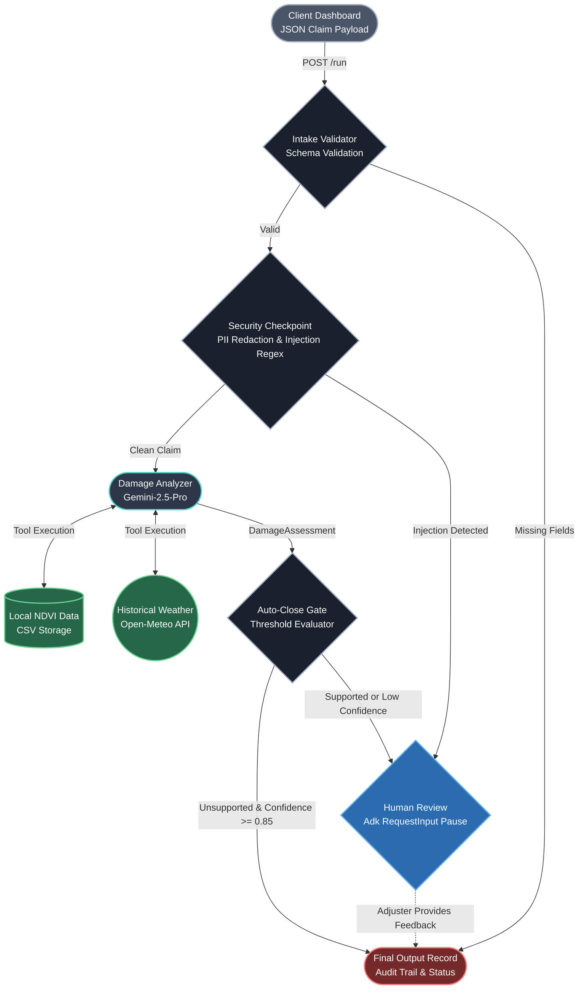

# Crop Insurance Claims Agent

An autonomous, agentic workflow built with Google's Agent Development Kit (ADK) that processes, verifies, and triages agricultural crop insurance claims using Gemini 2.5 Pro and external empirical data.

## The Problem
Agricultural insurance adjusters face a massive backlog of claims following weather events (e.g., droughts, floods). Manually verifying each claim is slow and subjective. However, completely automating the process introduces extreme financial and security risks, such as:
- **Fraud & Spoofing:** Claimants falsifying location or damage reports.
- **Prompt Injection:** Malicious claimants embedding instructions in their claim descriptions to trick the LLM into auto-approving payouts.
- **PII Leakage:** Sensitive data (SSNs, phone numbers) being sent to external LLM providers.

## The Solution
This project implements a secure, deterministic **Agentic Workflow** that acts as a middleware between the claimant and the human adjuster. 
It uses a **Defense-in-Depth** approach:
1. **Security Checkpoint:** A strict deterministic gate that aggressively scrubs PII (SSNs, phone numbers) and uses regex patterns to catch known prompt injection attacks *before* they ever reach the LLM.
2. **Empirical Verification:** If the claim is clean, the `damage_analyzer` (Gemini-2.5-Pro) uses external tools to pull historical weather data (Open-Meteo API) and local NDVI (Normalized Difference Vegetation Index) satellite crop data to verify the claimant's story.
3. **Threshold Auto-Closing:** If the empirical evidence blatantly contradicts the claim (e.g., claiming drought when rainfall was heavy) with high confidence, the system auto-closes the claim.
4. **Human-in-the-Loop (HITL):** All other claims, including those flagged for security violations, trigger an `adk_request_input` pause, safely suspending the workflow and alerting a human adjuster to make the final `Dismiss`, `Monitor`, or `Escalate` decision.

## Architecture & Workflow



## Setup & Execution

### 1. Requirements
- Python 3.10+
- `uv` (Python package manager)
- A Google Cloud Project with Vertex AI enabled, or a Google AI Studio API Key.

### 2. Environment Configuration
Ensure your `.env` file at the root of the project looks like this (adjust for your project):
```env
GOOGLE_GENAI_USE_VERTEXAI="true"
GOOGLE_CLOUD_PROJECT="<YOUR_PROJECT_ID>"
GOOGLE_CLOUD_LOCATION="us-central1"
```

### 3. Running the Backend (ADK Server)
Start the ADK web server. To allow the local HTML dashboard to connect without CORS errors, ensure you pass the `--allow_origins="*"` flag:
```bash
uv run adk web . --host 127.0.0.1 --port 8080 --allow_origins="*"
```

### 4. Running the Dashboard (Frontend UI)
We have included a lightweight, local-only static HTML dashboard (`dashboard.html`) designed specifically to demonstrate the system's triage capabilities, security badges, and human-in-the-loop interactions.

Because some browsers (like Chrome) strictly block CORS from local `file:///` paths, you must serve the dashboard over HTTP. 

In a **new terminal window**, run a static Python server:
```bash
uv run python -m http.server 8081
```

Next, open your browser and navigate to:
**[http://127.0.0.1:8081/dashboard.html](http://127.0.0.1:8081/dashboard.html)**

### 5. Testing the UI
Once the dashboard loads, click **Seed Test Claims (7)**. The dashboard will automatically hit the ADK server and run 7 distinct test scenarios, including:
- Standard Valid Claims
- Standard Invalid Claims (Auto-Closed)
- Claims containing PII (John Smith, SSN, Phone)
- Direct Prompt Injection Attempts ("ignore previous instructions")
- Paraphrased Prompt Injection Attempts

The UI will visibly display:
- **Red Badges** for security events caught by the checkpoint.
- **Yellow Badges** detailing exactly what PII was scrubbed.
- Real-time resolution buttons (**Dismiss / Monitor / Escalate**) allowing you to act as the human-in-the-loop and resume the paused workflows.

## Threat Model & Security Considerations
This project was built with a strict STRIDE threat model in mind (see `threat_model.md`). 

**Agent Skills:** This project includes a custom-authored Antigravity skill, stride-threat-model (.agents/skills/stride-threat-model/SKILL.md), built specifically for this project rather than relying only on pre-installed ADK skills. Running this skill against the codebase produced a full six-category STRIDE assessment (see threat_model.md), including a real vulnerability discovered and fixed during development, discussed below.

**Note on Prompt Injection Mitigations:** The system employs both regex-based checkpoints and defensive LLM system prompts to prevent attackers from using the claim description to hijack the `damage_analyzer`. However, prompt-level defenses are inherently not foolproof. These are *mitigations*, not 100% guarantees. The ultimate failsafe is the deterministic architectural routing that forces borderline or compromised claims to a human reviewer, preventing the LLM from ever authorizing a payout itself.

**Deployed on Agent Runtime:**


Here is the demo Video https://youtu.be/5_eTPSxXJig?si=Gy9AqzTrBMuwP9S-
